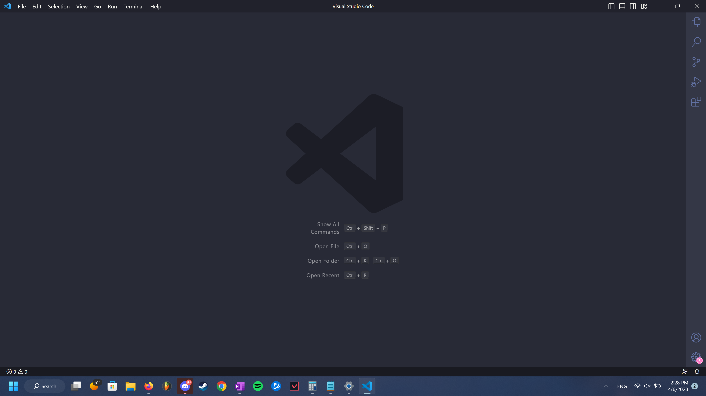
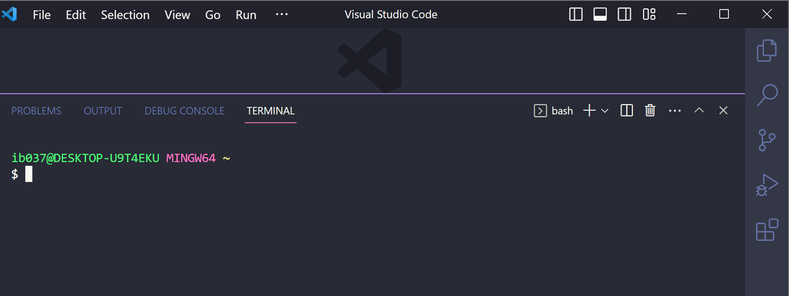
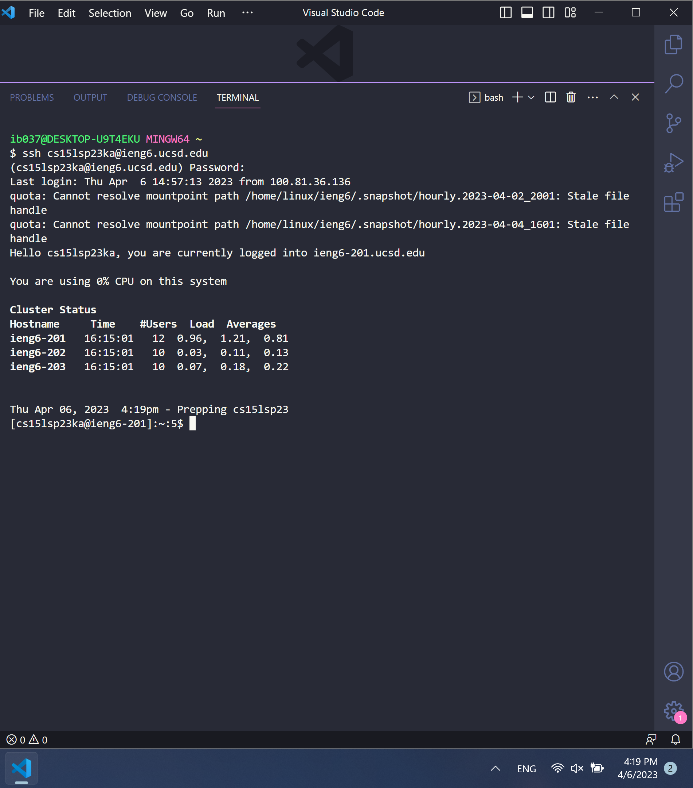

# Lab Report 1

In this lab, I will be going over how to install Visual Studio code for the first time, how to be able to log into your course-specific account on `ieng6`, and showing some basic commands you can try out after successfully logging in to your course specific account. 

We will be proceeding with the assumption that you were able to find your CSE15L course account through here:

## Installing Visual Studio Code
In order to install visual studio code, we must go to the website to download and install to our computer. 

After following the instructions and have downloaded visual studio code, if correctly installed, when opening up Visual Studio, it should look like this:

The color may be different depending on how the user has customized Visual Studio code in their working space. For now, we have installed Visual Studio code. 

## Remotely Connecting to ieng6 
In order to complete this part, be sure to have your CSE15L account and password reset AND have Visual Studio code installed. 

Since I am using Windows, I will be installing 

In Visual Studio code, I will be setting the terminal to use `bash`.

Next we will be opening up a new terminal that should look like the following:

We will use `ssh` by using the terminal we just opened up and typing in the following but changing the `zz` letters with the letters of your own account that we searched up earlier. 

`$ ssh cs15lsp23zz@ieng6.ucsd.edu`

If it's your first time connecting to the server, you will be met with a message that will ask you to type in `yes` to continue. After you will then be connected and see a screen similar to this one. 

