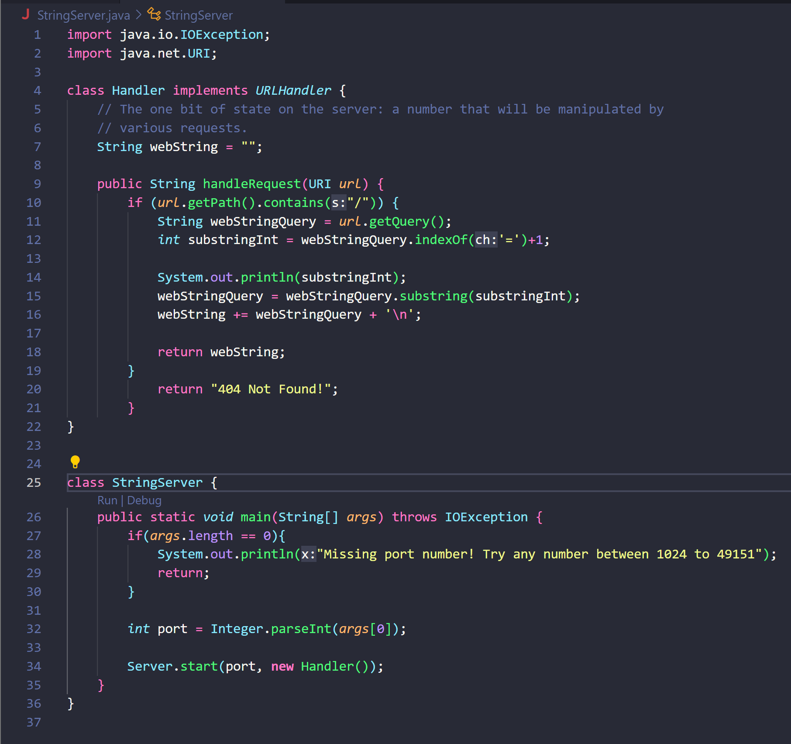
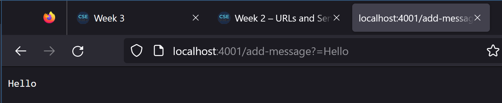
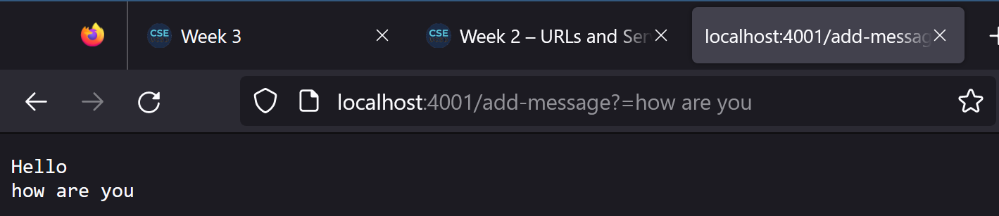

# Lab Report 2
In this lab report, I will be writing a web server called `StringServer` and finding a solution to one of the bugs that we went over in lab three.

## Part 1
In order to complete the first part of this lab report, I will be basing the code off from the `wavelet` code from the lab. For the web server `StringServer`, I I want to be able to keep track of a single string that will keep being added to depending on the incoming requests.

Explaining the code above: The code takes in the URL and checks if it contains `/`, which will then go and obtain the query by using `.getQuery()`. After that, we want to check the location of `=` in the string so we will be able to successfully seperate the message using `.substring()` and add it to our `webstring` variable of type string that will keep adding on to it and using a `\n` to put each message on a new line. 

Anything that is on the other side of `=`, the code will take it in as a string and add it in to our `webString` variable. 

Here are two screenshots of using `/add-message`:

For this piece, the code that is being called first checking that the URL has `/` and obtaining the query because it does include it. It then checks what comes after the `=` and adding it to our originally empty variable `webString`. It creates a new line at the end using `\n` for the next incoming message from the URL.

For this piece, the same piece of code runs as above. We consider anything that is to the right of `=` as a string and add it on a next new line to the webString. 

## Part 2

## Part 3
Something that I learned in both week 2 and week 3 lab was running a server on a remote computer. The concept was interesting to learn at first and a bit confusing and I had to understand how recognizing the different parts of a URL are important in order to be able to make the server do what we want by using the information in a URL.
