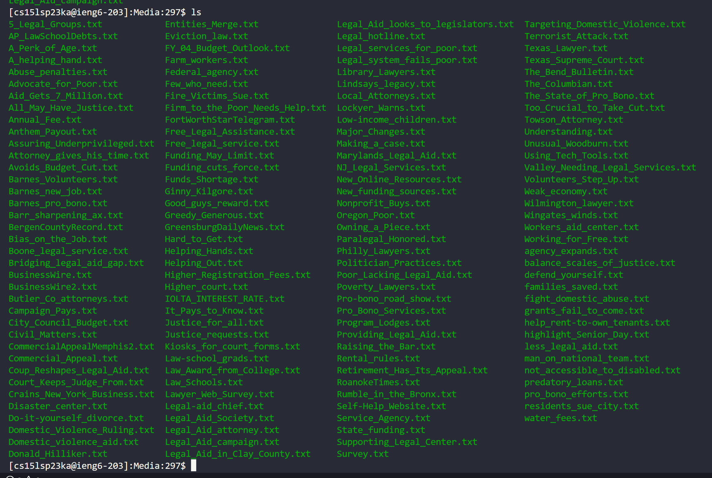
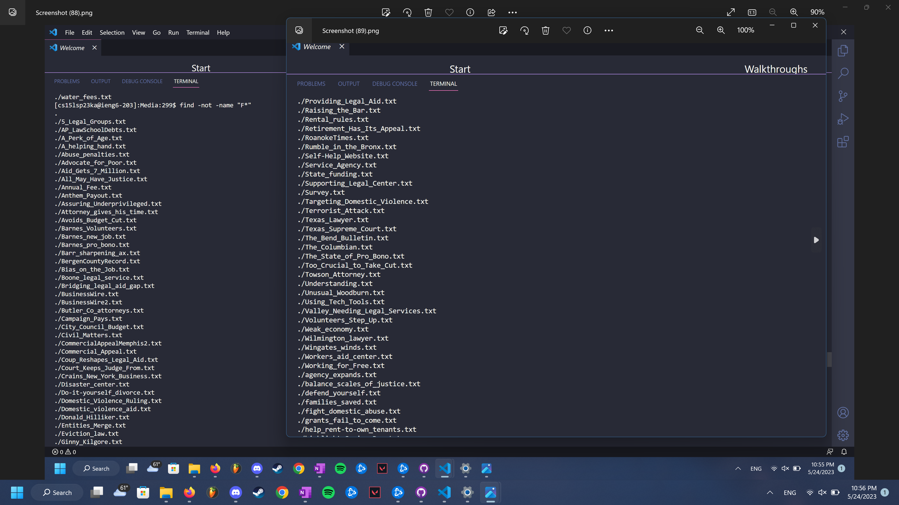
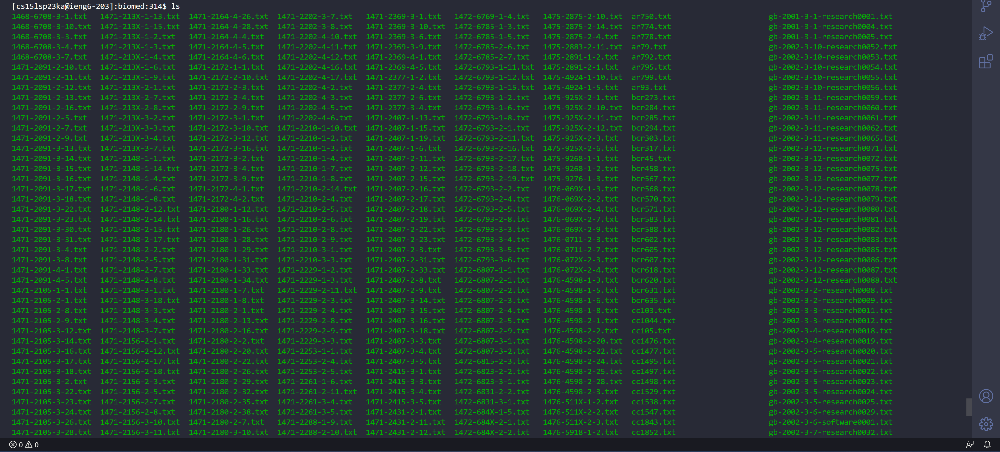

# Lab Report 3
This lab report will be focusing on researching `find` command online. I will be finding 4 interesting command-line options or alternative ways to use the command `find`. 

**Note that for some of the examples, I will be combining the usage of more than one command line options used with `find` in order to explore different combinations of how to use `find`**

## What is `find`?
Before researching different/ alternative ways of using the command. I do want to review, (mainly for my sake), the purpose of using `find` and how it can be useful. In general, the `find` command allows us to be able to search for files and directories. For example if I open up a terminal in `Visual Studios` and run the find command just by itself with nothing else attached, it will start searching through ALL of the files since I did not specify what I was trying to find. 

This is just a small part of what bash was doing, I had to stop it from going through all the files because it was too much. 

So now lets try using `find` with a word attached to it to make it try finding more specific files/directories. 

Here we can see there is significantly less files/directories that were found when we added a word next to `find`. It just filters what we're trying to look for. 

Now that I've explained a little basics on what `find` is used for, I will be showing my research on command-line options/ alternative ways to use the command and show 2 examples for each.

## 1: Using `-not`
**Source**: [Using not with find](https://adamtheautomator.com/bash-find/#Filtering_out_Files_with_the_-not_Operator)

In the write-up for lab report 3, we are told to use the files and directories from `./technical` so that is where I will be pulling the examples from. 

Using `-not` combined with `find` will be able to filter out anything we know we are NOT looking for. Or just remove certain files/directories in general to make it easier to find what we are looking for.

### Example 1: Using -not by itself with find

Here are all the files that are within `docsearch/technical/government/Media`. Those are a lot of files that we might not even need all of them. Say for example we don't need any of the ones containing the letter `F`. 

In the picture we can see it filters out all the files within `docsearch/technical/government/Media` that start with capital F. It is case sensitive and goes through each file inside of the directory we are in. 

## 2: Using `-and`
**Source**: [Using and with find](https://adamtheautomator.com/bash-find/#Combining_Two_Conditions_with_the_-and_Operator)

Now that we know how to filter out words we are not looking for, what if we have more than one keyword of the file we are looking for? That's where `-and` comes into use and can be useful when trying to find files that contain more than one key word of what you are looking for. 

### Example 2: Using -and by itself with find

Here we can see there are a ton of txt files within biomed! Let's try filtering out the ones we are looking for using keywords such as `gb` and `12` in order to just get the files containing that. 

We can see that using `-and` filtered out everything inside of the biomed directory and left us with anything containing `gb` and `12`! 

### Example 3: Combining the usage of `-and` and `-not`
What if we want to filter out words depending on what keywords we know NOT to look for. (Notice I said keywordS meaning multiple ones!) We can use `-not` and `-and` in a combination to filter out multiple key words on what we are NOT looking for. 

I kinda went a little crazy typing up the words I wanted to filter out from `biomed` (mainly because I want it to fit on a screenshot but that's beside the point!). Aside from showing the possibility of combining `-not` and `-and` I also demonstrated the fact that you can format it like a run-on sentence, allowing multiple keywords of words you are either trying to look for or NOT trying to look for! Pretty cool :D
