## Lab Report 4
In this lab report, I will be reproducing the tasks from the week 7 lab on my own starting from step 4 through 9. For each step, I will be showing a screenshot and writing down the keys that were pressed to get to that step.  

## Step 4: Log into ieng6
Starting from step 4, I log in to my `ieng6` account. 
I open up a new terminal using *`<ctrl><shift><backtick>`*
In case I forget how to log in to my `ieng6` account, I can go to [Lab Report 1](https://iscbel.github.io/cse15l-lab-reports/LabReport1.html#remotely-connecting-to-ieng6) and follow the instructions. 

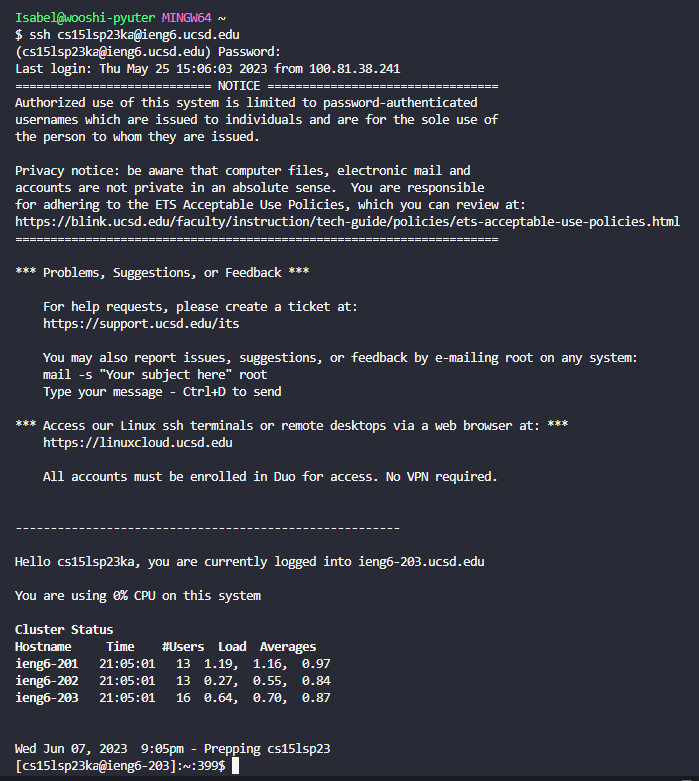

## Step 5: Clone your fork of the repository from your github account
Now that we are logged in to our `ieng6` account, we clone the fork of the repository to our github account. I type in [Lab 7](https://github.com/ucsd-cse15l-s23/lab7) (the link) and hit *`<enter>`* is what we are cloning and as shown in the picture below, we have done that successfully. 
We clone by using `git clone` followed by the link of the github repository we are trying to clone. I also typed in `ls` to show that we had cloned it successfully. 

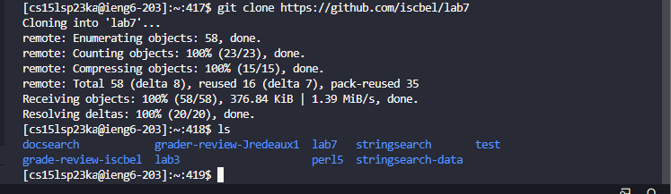
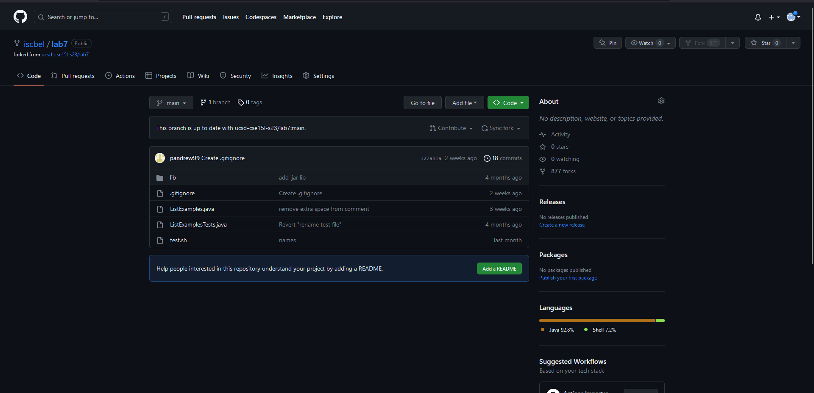

## Step 6: Run the tests, demonstrating that they fail
Now that we have the lab7 directory, we must change directories in order to run the tests. We do so by typing in `cd lab7` and hitting *`<ENTER>`*. 

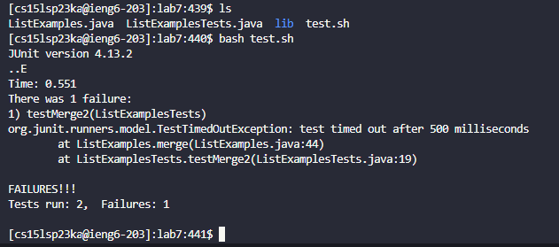

We can see that there is one failure when running the bash script. We must edit the file to fix this issue.

## Step 7: Edit the Code file to fix the failing test
Now that we know that the code is not running properly, we open up `ListExamples.java` using vim. 

I type in `vim ListExamples.java` followed by *`<ENTER>`* and we reach the text editor through the terminal. 

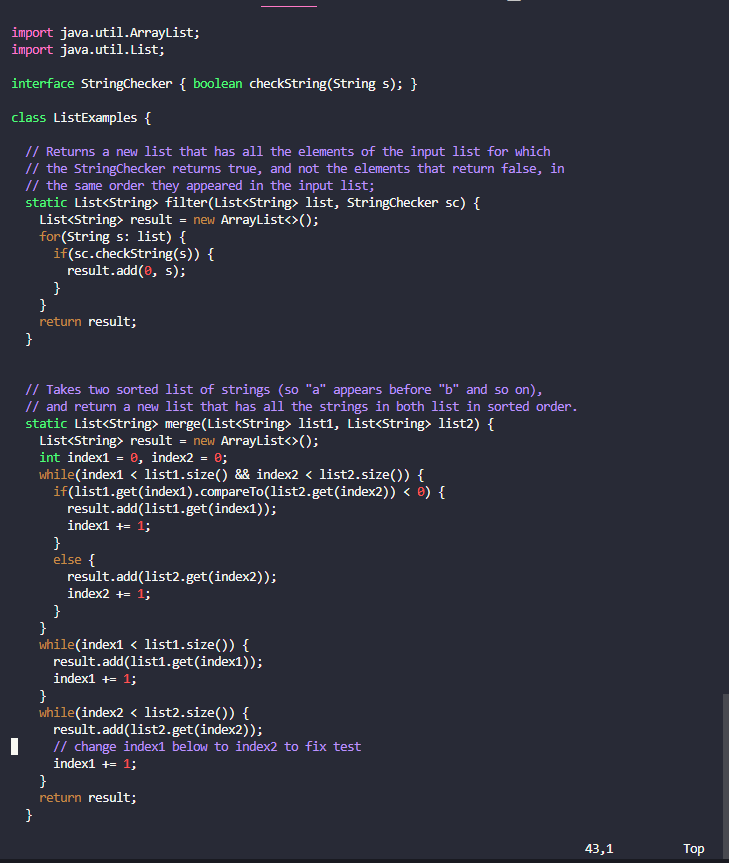

This is what we see and we cannot move our cursor to where we want to make changes to we have to use arrow keys in order to arrive to where we want. 

This is where we want to get to:

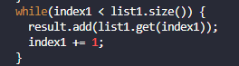

We know that the line we want to change contains the word `index1` therefore we can type in `/index1` followed by *`<enter>`* to get to the first occurrence of the word `index1`.
We get to the first instance of `index1` and in my case I hit *`<n>`* 2 times to get to the desired location as shown by the picture below. (Depending on where you are, you might need to hit *`<n>`* a couple of times to get to the desired location. 

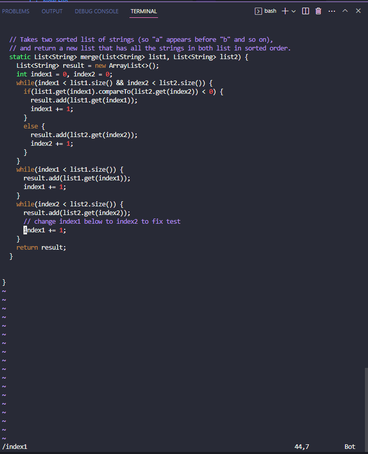

Now we need to get the cursor on top of the 1 in order to change it to a 2. 
We get there by typing `<l><l><l><l><l>`
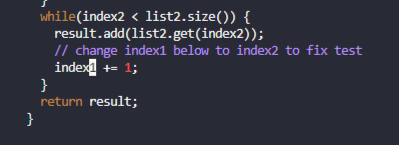

Now that we are at the location that we want to edit. We type `x` in order to delete the one. 

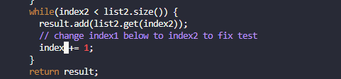

Once deleted, we type `i` in order to go into editing mode and type `2` to make the change.
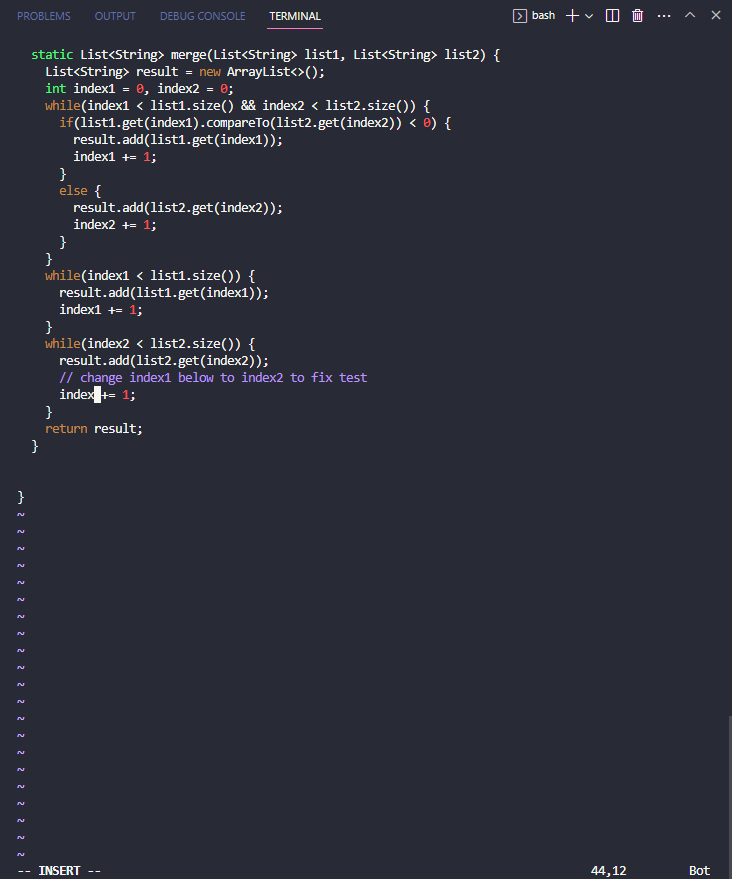
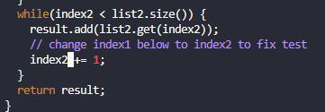

Since we are still in insert mode we need to switch out of it before closing and saving and we do so by hitting *`<ESC>`* followed by typing `:wq` to quit and save. 
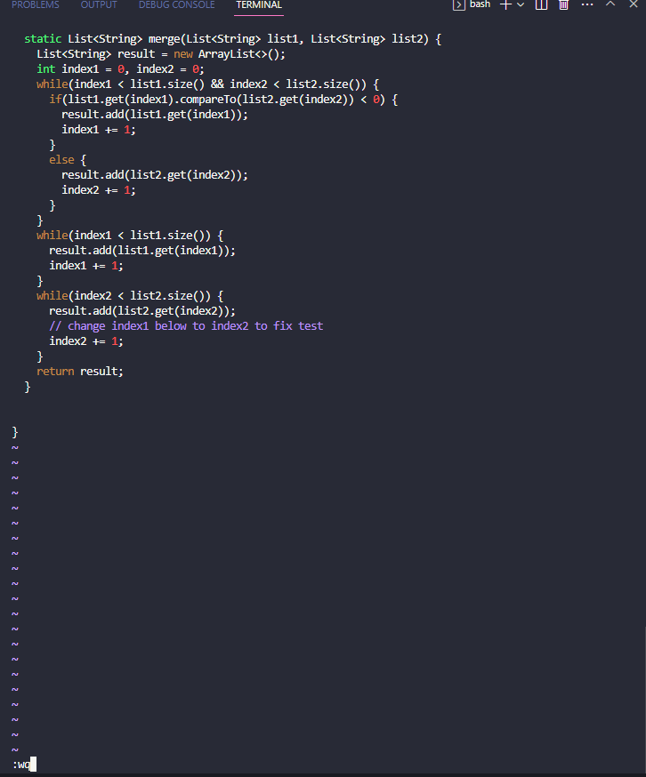

## Step 8: Run the tests, demonstrating that they now succeed
Now that we have fixed our code through vim, we want to show that the test will run perfectly this time!
We can press `<up>` `<up>` `<up>` and then `<ENTER>` to run `bash test.sh` again.

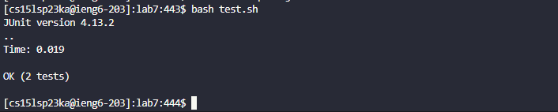

## Step 9: Commit and Push the resulting change to your github account
Great! Now we have our code working properly so we want to push it towards the repository we copied it from. 

We type `git add ListExamples.java` and following it up with *`<ENTER>`* in order to include the changes. 

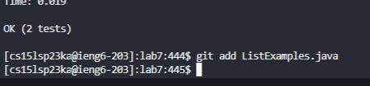

To fully commit we type in `git commit -m "Commit Message"` and follow it up with *`<ENTER>`*

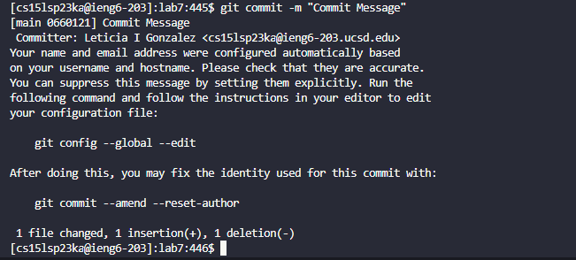

At the bottom we can see the amount of files that were changed, what was inserted, and what was deleted!

Finally to push it to our accounts, we type `git push` and *`<ENTER>`* to push the changes we made. 

Side note: For some reason it is not allowing me fully push because it says my password failed. In the lab, my lab partner was able to push it without the authenticator so I know this step is correct. I went through the steps in the lab such as adding the authenticator key to github, however for some reason `git push` still does not want to work.

The changes should reflect on our github repository now!
