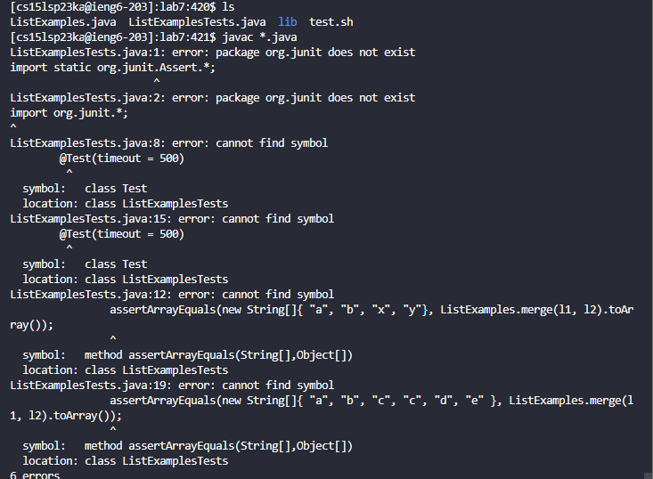

## Lab Report 4
In this lab report, I will be reproducing the tasks from the week 7 lab on my own starting from step 4 through 9. For each step, I will be showing a screenshot and writing down the keys that were pressed to get to that step.  

## Step 4: Log into ieng6
Starting from step 4, I log in to my `ieng6` account. 
I open up a new terminal using *`<ctrl><shift><backtick>`*
In case I forget how to log in to my `ieng6` account, I can go to [Lab Report 1](https://iscbel.github.io/cse15l-lab-reports/LabReport1.html#remotely-connecting-to-ieng6) and follow the instructions. 

## Step 5: Clone your fork of the repository from your github account
Now that we are logged in to our `ieng6` account, we clone the fork of the repository to our github account. [Lab 7](https://github.com/ucsd-cse15l-s23/lab7) is what we are cloning and as shown in the picture below, we have done that successfully. 
We clone by using `git clone` followed by the link of the github repository we are trying to clone. I also typed in `ls` to show that we had cloned it successfully. 

## Step 6: Run the tests, demonstrating that they fail\
We try compiling both java files that are inside our directory by using `javac *.java` which compiles all the java files inside of the directory.

## Step 7: Edit the Code file to fix the failing test
## Step 8: Run the tests, demonstrating that they now succeed
## Step 9: Commit and Pus the resulting change to your github account
