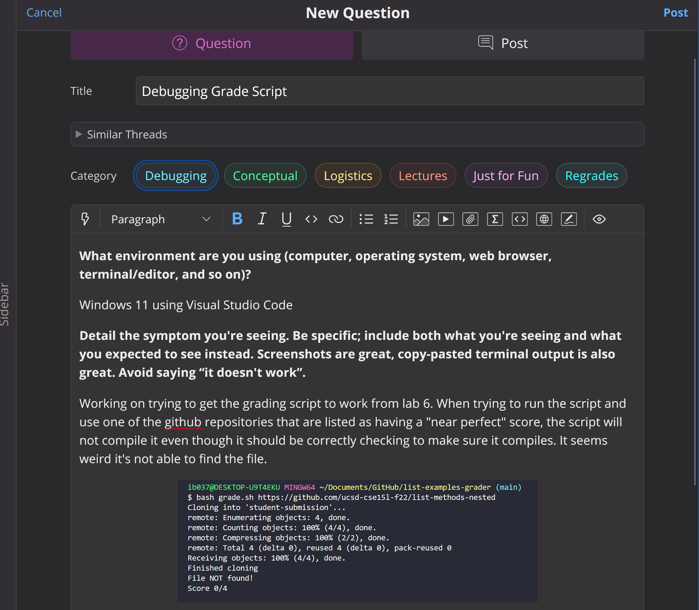
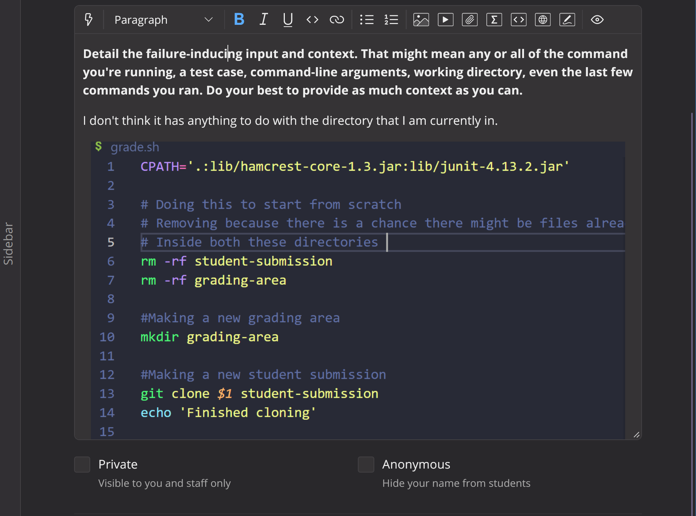
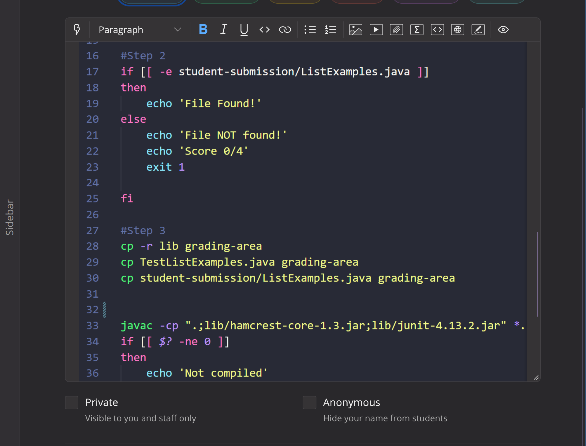
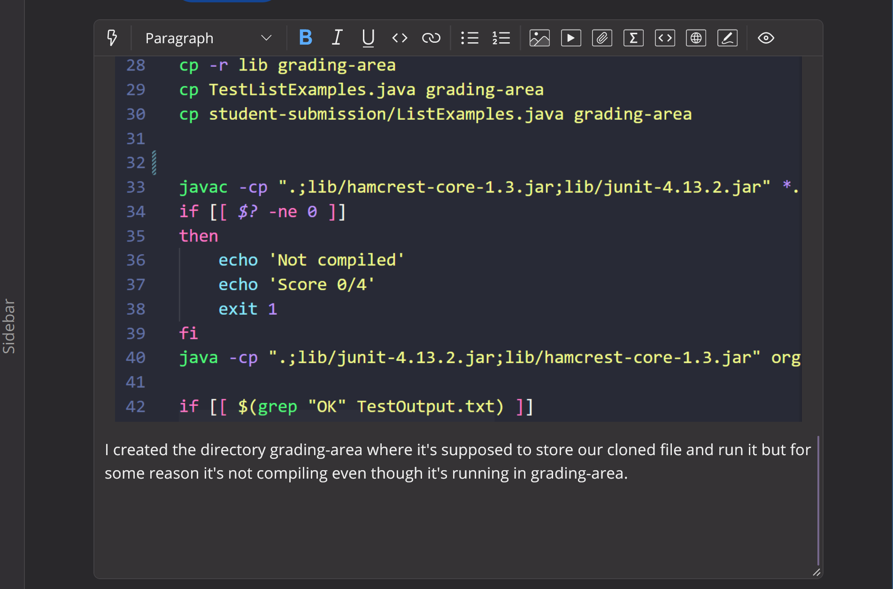
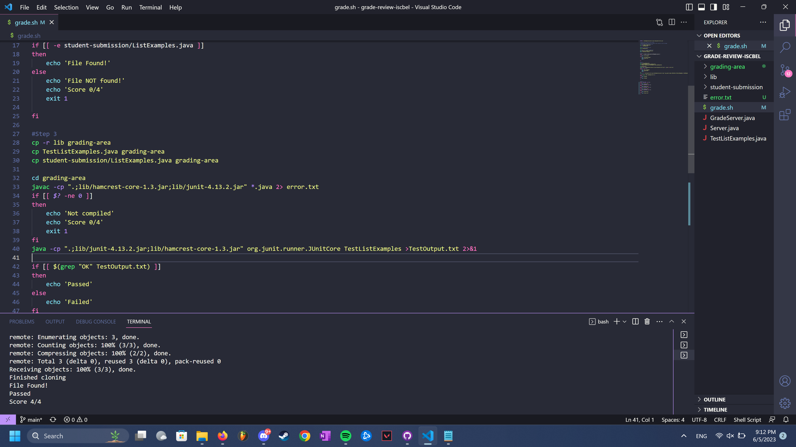

# Lab Report 5
## Part 1: Debugging Scenario
### 1: Student with a screenshot on EdStem
Here is a "student's" post on edstem regarding a bug they have in their code and they can't seem to explain why it is happening.

### 2: Response from the TA (mimicking a TA)
Response: I see you are having an issue of the file you are trying to compile not being found. I need to see more screenshots as to what files are in the directory you are currently in. There could be a lot of things causing the error that won't make the file compile and the most common one might be the directory you are currently in. Make sure you are keeping track of where you are in the directory as it can get confusing when using bash. You are correctly cloning the files into the grading-area but are you sure you're actually inside of the grading area? 

### 3: Another screenshot from the student
Response from student: After thinking about it, I understand that I have to keep track of what directory I am running the bash script is. Before asking for help, I see that my issue was that it was not finding or compiling the file I wanted it to because it was all being stored inside of the grading-area, which I never switched my directory towards the grading area. Here is an update of my error and the fix.

In Line 32, I ensured that we go into the grading-area to go and compile the file and actually run it to see if it works. And it did!

LAB REPORT NOTE: I used the code from lab 6 where we wrote the grading script and for my lab report i used this as the issue because it's the issue I had in lab and I figured out that the error was due to not keeping track of what directory I was in. 

## Part 2: Reflection
During this quarter and my experience with CSE15-L, I learned quite a bit of useful techniques and such. Something I learned that completely changed the way I saw this class and other coding classes was when we wrote the script of the auto grader similar to how gradescope uses scripts as well to grade our PAs. At first I do admit it was pretty confusing but my TA was so awesome and helpful and guided me through the lab and I was able to finish writing a script for a basic grader!
